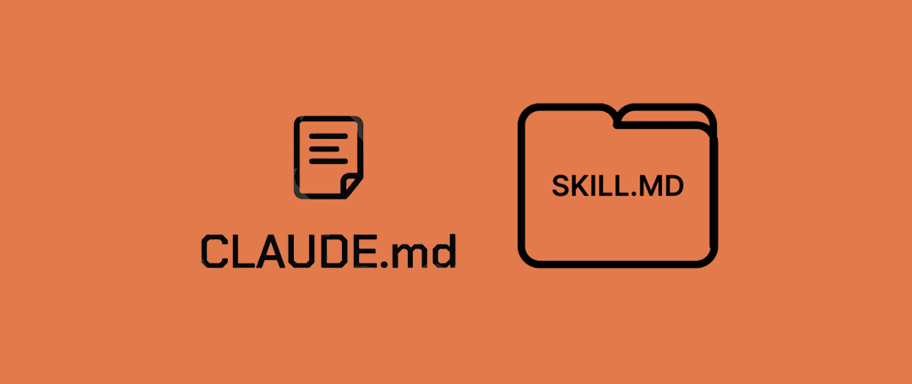

<p align="center"></p>
<h1 align="center"> claude_carjavi </h1> 
<h4 align="right">Ago 26</h4>

<p>
  
  
  
  
</p>

<br>

## Estructura 
```bash
claude_github/
├── CLAUDE.md                    (5.865 caracteres)
├── skills/
│   ├── python-defaults/SKILL.md
│   ├── javascript-node-defaults/SKILL.md
│   ├── embedded-firmware-cpp/SKILL.md
│   ├── research-references/SKILL.md
│   └── source-metadata-header/SKILL.md
├── install.ps1                  (Windows)
└── install.sh                   (macOS/Linux )
```

## Install
```bash
git clone https://github.com/carjavi/claude_carjavi
```
### Windows
```PowerShell
# Desde PowerShell
cd claude_carjavi
# Cambia la política de seguridad de PowerShell. Bypass no exige firma ni pregunta nada, y como es -Scope Process solo aplica a esta ventana de PowerShell, no cambia la configuración de tu sistema
Set-ExecutionPolicy -ExecutionPolicy Bypass -Scope Process; .\install.ps1
```

### Linux
```bash
claude_carjavi
chmod +x install.sh && ./install.sh
```

<br>

<br>

---

<div>
  <p>
     Copyright &nbsp;&copy; 2023 Instinto Digital <a href="https://carjavi.github.io/" title="carjavi.github">carjavi</a>
  </p>
</div>

<p align="center">
    <a href="https://instintodigital.net/" target="_blank"></a>
</p>


# 
Mi configuración personal de Claude Code (P.D. no hay data sensibles)
